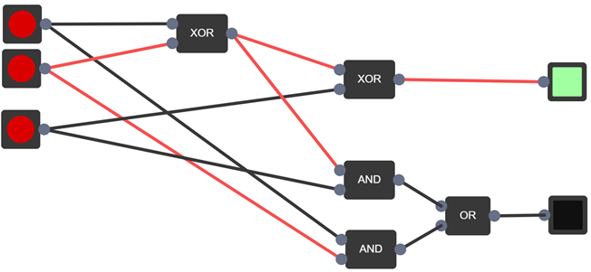

# Computer Basics

Denne opgave er lavet i sammenhæng med programmerings B eksamen i 2.G. Programmet er lavet ved hjælp af p5.js, og skrevet i Typescript.
Programmet simulerer et binært kredsløb som brugeren designer. Man kan se hvordan forskellige gates interagere med hinanden. Man kan også kombinere en masse gates og få en helt ny gate.
Programmet er udviklet til undervisning. Det kan være svært at forestille sig hvordan en computer fungerer, men fordi det her er interaktivt og relativt simpelt, så giver det en hel ny måde at lære på.
På billedet ses et eksempel på hvordan et kredsløb kan laves.

Den færdige rapport kan findes [her](docs/rapport.pdf)
